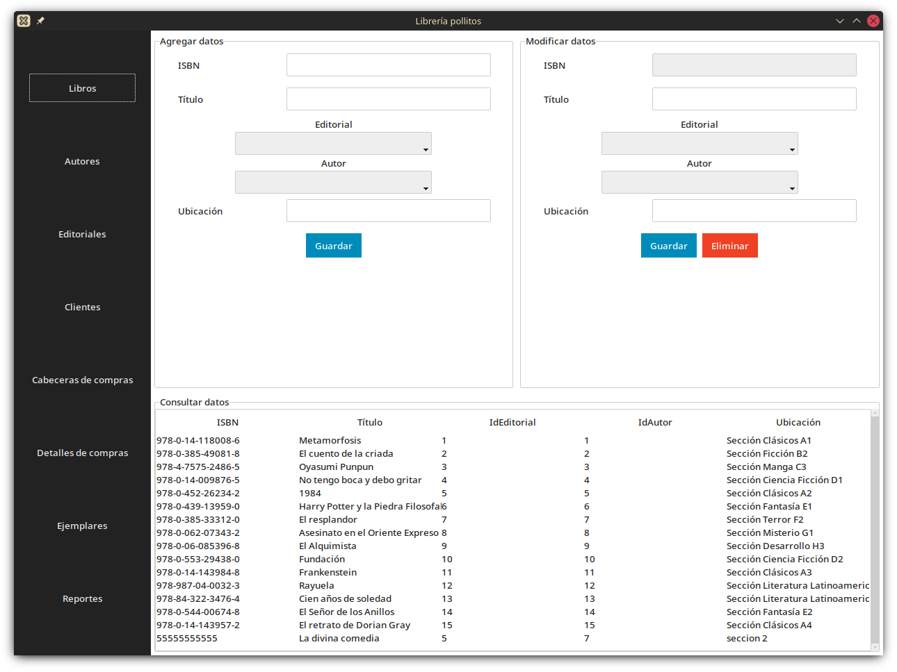
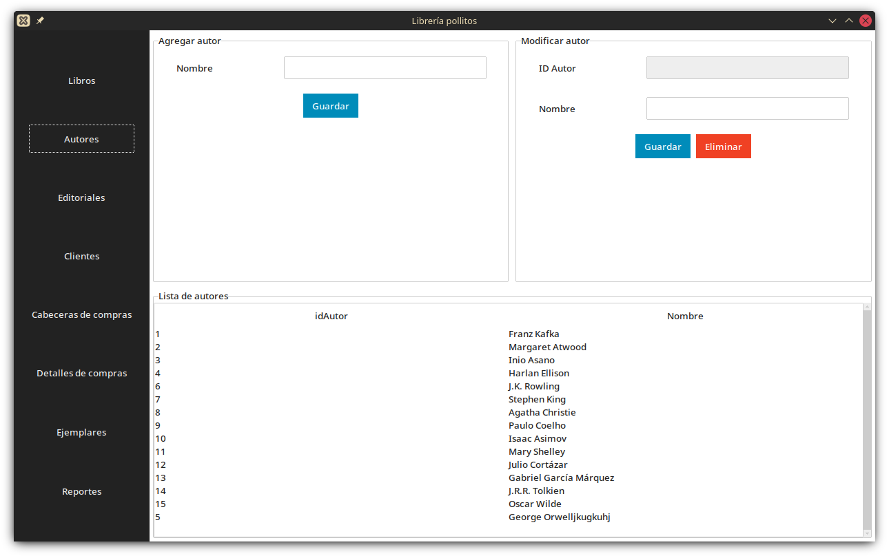
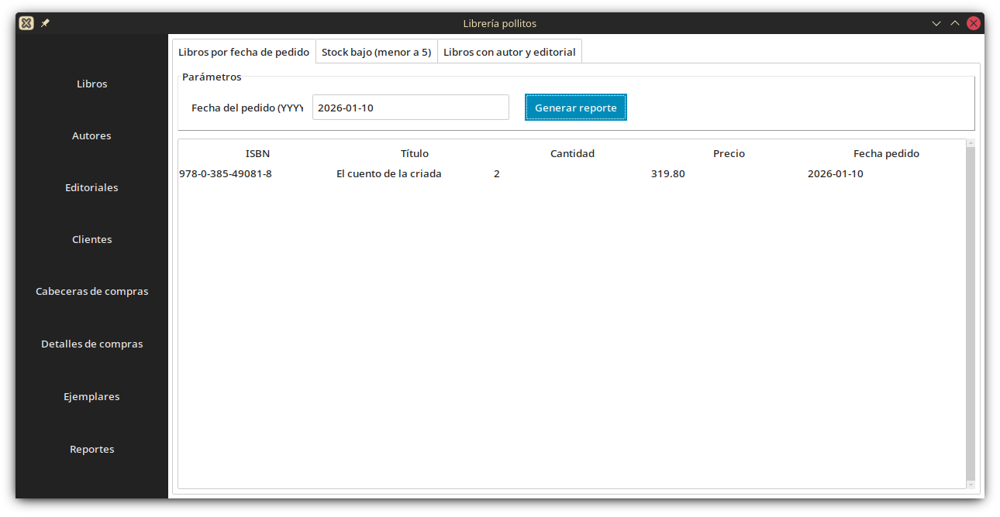
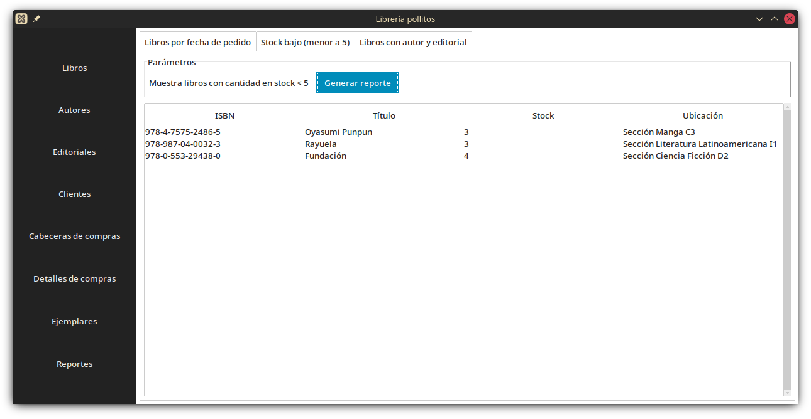
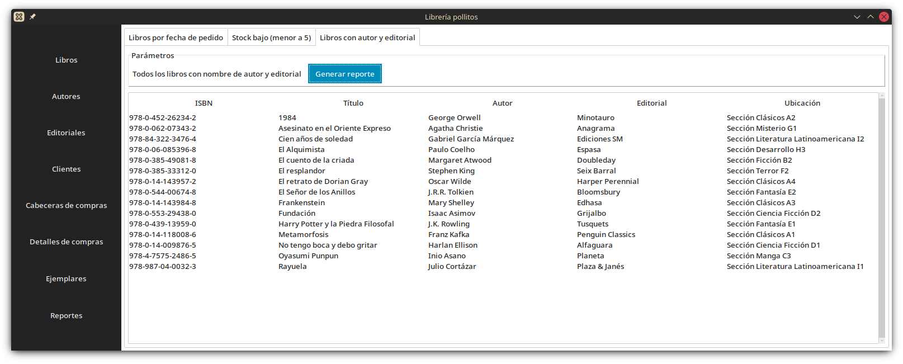

# Examen práctico: Librería

**UNIVERSIDAD AUTÓNOMA DEL ESTADO DE MÉXICO**

**Profesora:** Carol Leyva Pelaez

**Materia:** Bases de Datos 1

**Alumnos:**

1. Irma Joseline Garcia Aguirre
2. Gael González Méndez

# Instalación

## Requisitos

- Python 3.8 o superior
- PostgreSQL

## Instalación

Instalar las dependencias Python del proyecto:

```bash
pip install -r requirements.txt
```

## Configurar PostgreSQL

Crear un usuario y una base de datos (ejemplo):

```bash
sudo -u postgres psql -c "CREATE USER pollo_admin WITH PASSWORD 'password';"
sudo -u postgres psql -c "CREATE DATABASE pollo_library OWNER pollo_admin;"
```

Guardar variables en config.ini

```ini
[db]
host=localhost
database=pollo_library
user=pollo_admin
password=password
port=5432
```

## Ejecutar la aplicación

Ejecute la aplicación según la convención del proyecto. Por ejemplo:

```bash
python3 main.pyw
```

**Nota:** Es probable que Postgresql necesite de configuración previa para funcionar, será necesario habilitar la autenticación por contraseña

# Scripts

1. Crear base de datos

```bash
python3 -m src.utils.CreateTables
```

2. Agregar registros pre cargados

```bash
python3 -m src.utils.InsertData
```

3. Eliminar tablas de la base de datos

```bash
python3 -m src.utils.DropTables
```

# Vistas

## Libro



Componentes CRUD:

### CREATE

**Crear tabla:**

```sql
CREATE TABLE IF NOT EXISTS libro (
ISBN VARCHAR(255) PRIMARY KEY,
Titulo VARCHAR(255) NOT NULL,
IdEditorial INT NOT NULL REFERENCES Editoriales(idEditorial),
IdAutor INT NOT NULL REFERENCES Autores(idAutor),
Ubicacion VARCHAR(255) NOT NULL
```

**Crear registro**

```sql
INSERT INTO {table} (ISBN, Titulo, IdEditorial, IdAutor, Ubicacion)
VALUES ('{ISBN}', '{Titulo}', '{Editorial.id}', '{selAutor.id}', '{Ubicación}');
```

### READ

La instrucción para obtener los registros de la base de datos se genera de manera automática a través del método de la clase Model

```python

# src.model.Model.py
def _select_query(
        self,
        columns: Optional[List[str]] = None,
        where: Optional[str] = None,
        order_by: Optional[str] = None,
        limit: Optional[int] = None,
    ) -> str:
        """Genera el SQL para seleccionar registros de la tabla"""
        column_list = "*" if not columns else ", ".join(columns)
        query = f"SELECT {column_list} FROM {table}"

        if where:
            query += f" WHERE {where}"
        if order_by:
            query += f" ORDER BY {order_by}"
        if limit is not None:
            query += f" LIMIT {limit}"

        return f"{query};"

```

### UPDATE

```sql
UPDATE {table}
SET Titulo = '{Titulo}',
IdEditorial = '{Editorial.id}',
IdAutor = '{Autor.id}',
Ubicacion = '{Ubicación}'
WHERE ISBN = '{ISBN}';
```

### DELETE

```sql
DELETE FROM {table}
WHERE ISBN = '{ISBN}';
```

## Autor



Componentes CRUD:

### CREATE

**Crear tabla:**

```sql
CREATE TABLE IF NOT EXISTS {table} (
            idAutor SERIAL PRIMARY KEY,
            Nombre VARCHAR(255) NOT NULL
        );

```

**Crear registro**

```sql
INSERT INTO {table} (Nombre)
VALUES ('{Nombre}');
```

### READ

La instrucción para obtener los registros de la base de datos se genera de manera automática a través del método de la clase Model

```python

# src.model.Model.py
def _select_query(
        self,
        columns: Optional[List[str]] = None,
        where: Optional[str] = None,
        order_by: Optional[str] = None,
        limit: Optional[int] = None,
    ) -> str:
        """Genera el SQL para seleccionar registros de la tabla"""
        column_list = "*" if not columns else ", ".join(columns)
        query = f"SELECT {column_list} FROM {table}"

        if where:
            query += f" WHERE {where}"
        if order_by:
            query += f" ORDER BY {order_by}"
        if limit is not None:
            query += f" LIMIT {limit}"

        return f"{query};"
```

### UPDATE

```sql
UPDATE {table}
SET Nombre = '{Nombre}'
WHERE idAutor = {idAutor};
```

### DELETE

```sql
DELETE FROM {table}
WHERE idAutor = {idAutor};
```

# Reportes

## Pedidos por fecha



```sql
SELECT
l.isbn, l.titulo, cd.cantidad, cd.precio, cc.fecha
FROM compradetalle cd
JOIN compracabecera cc ON cd.idcompra = cc.idcompra
JOIN libro l ON cd.isbn = l.isbn
WHERE cc.fecha = '{fecha}'
ORDER BY cc.fecha, l.titulo;
```

## Libros con stock menor a 5



```sql
SELECT  l.isbn, l.titulo, e.cantidadexistencia AS stock, l.ubicacion
FROM libro l
JOIN ejemplares e ON l.isbn = e.isbn
WHERE e.cantidadexistencia < 5
ORDER BY e.cantidadexistencia;
```

## Libros registrados por nombre de autor y editorial



```sql
SELECT l.isbn, l.titulo, a.nombre AS autor, e.nombre AS editorial, l.ubicacion
FROM libro l
JOIN autores a ON l.idautor = a.idautor
JOIN editoriales e ON l.ideditorial = e.ideditorial
ORDER BY l.titulo;
```

## Rúbrica de evaluación

### Base de datos

- [x] Libro(ISBN, Titulo, IdEditorial, IdAutor, Ubicacion)
- [x] Editorial(IdEditorial, nombre)
- [x] Autor(IdAutor, Nombre)
- [x] Ejemplares(ISBN, cantidadExistencia, precioVenta)
- [x] CompraCabecera(IdCompra, Fecha, IdCliente, TotalCompra)
- [x] CompraDetalle(IdCompra, ISBN, cantidad, precio)
- [x] Cliente(IdCliente, Nombre, Apellidos, CorreoElectronico, NumCelular)

### Interfaz gráfica

- [x] De acuerdo al lenguaje programación de su elección, generar la conexión a la base de datos.
- [x] Generar dos pantallas para realizar el registro de datos, una pantalla para modificar y los siguientes reportes:
- [x] Mostrar los datos de los libros incluidos en los pedido de una fecha determinada por el usuario.
- [x] Indicar el título de todos los libros cuya cantidad en stock sea menor a 5
- [x] Indicar el nombre de todos los libros registrados con el nombre de autor y editorial.

### Manejo de la base de datos

- [x] Crear la base de datos en el SGBD que haya elegido.
- [x] Insertar 15 registros en cada una de las tablas creadas.
